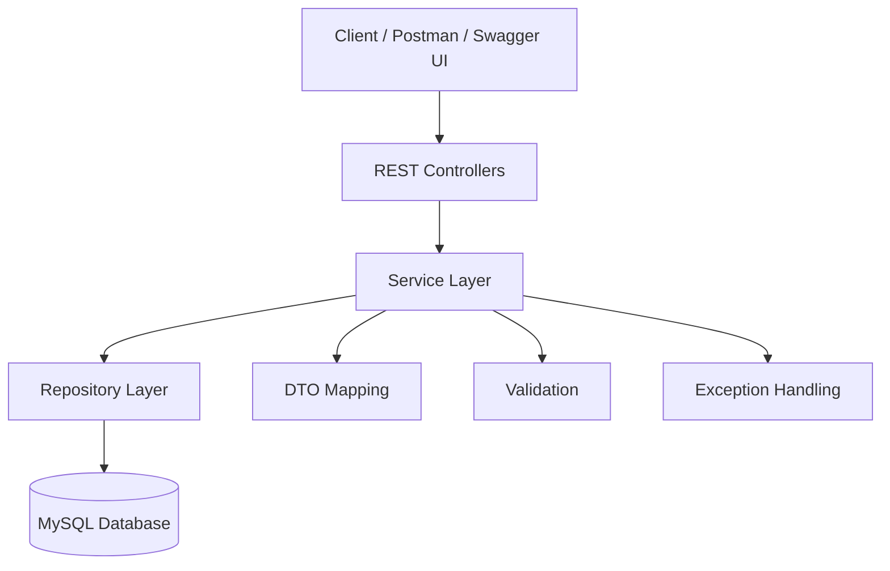
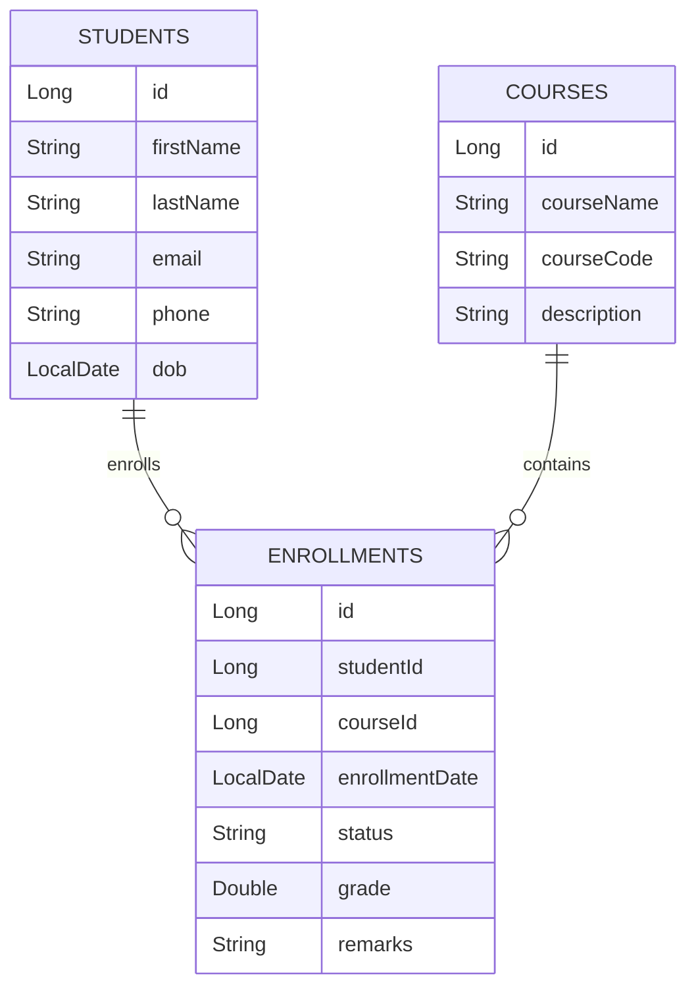

# 🎓 Student Management System REST API


## 📖 Project Description

The **Student Management System REST API** is a backend application built using **Spring Boot** that provides RESTful APIs for managing students, courses, enrollments, grades, and reports.

The project follows a clean layered architecture and demonstrates enterprise backend development practices including validation, exception handling, pagination, searching, testing, and API documentation.

This project was built as part of a Java Backend Developer learning journey and showcases production-ready REST API development using Spring Boot.

## ✨ Features

### 👨‍🎓 Student Management
- Create Student
- Get Student by ID
- Get All Students
- Update Student
- Delete Student
- Search Students
- Pagination & Sorting

### 📚 Course Management
- Create Course
- Get Course by ID
- Get All Courses
- Update Course
- Delete Course
- Search Courses
- Pagination & Sorting

### 📝 Enrollment Management
- Enroll Student into Course
- Update Enrollment
- Delete Enrollment
- Search Enrollments
- Pagination & Sorting

### 🎯 Grade Management
- Assign Grades
- Update Grades
- Instructor Remarks
- ACTIVE Enrollment Validation

### 📊 Reports
- Student Performance Report
- Course Performance Report
- Average Grade Calculation

### 🛡 Validation & Exception Handling
- Bean Validation
- Custom Exceptions
- Global Exception Handler

### 📖 API Documentation
- Swagger UI
- OpenAPI 3 Documentation

### ✅ Testing
- JUnit 5
- Mockito
- MockMvc

## 🛠️ Tech Stack

| Category | Technologies |
|----------|--------------|
| Language | Java 21 |
| Framework | Spring Boot |
| ORM | Spring Data JPA, Hibernate |
| Database | MySQL |
| Build Tool | Maven |
| API Documentation | Swagger / OpenAPI 3 |
| Validation | Jakarta Bean Validation |
| Object Mapping | ModelMapper |
| Boilerplate Reduction | Lombok |
| Testing | JUnit 5, Mockito, MockMvc |
| Version Control | Git & GitHub |
| IDE | IntelliJ IDEA |

## 🏗️ Project Architecture



## 📂 Project Structure

```text
src
├── main
│   ├── java
│   │   └── com.sagar.sms
│   │       ├── config
│   │       ├── controller
│   │       ├── dto
│   │       ├── entity
│   │       ├── exception
│   │       ├── repository
│   │       ├── services
│   │       └── StudentManagementSystemApplication.java
│   │
│   └── resources
│       ├── application.properties
│       └── static
│
└── test
    └── java
        └── com.sagar.sms
            ├── controller
            └── services
```

## 🗄️ Database Schema

The application uses **MySQL** and consists of the following tables:

- **students**
- **courses**
- **enrollments**

### Relationships

- One Student → Many Enrollments
- One Course → Many Enrollments
- Enrollment stores:
  - Student
  - Course
  - Grade
  - Remarks
  - Status

 ## 📊 Entity Relationship Diagram




