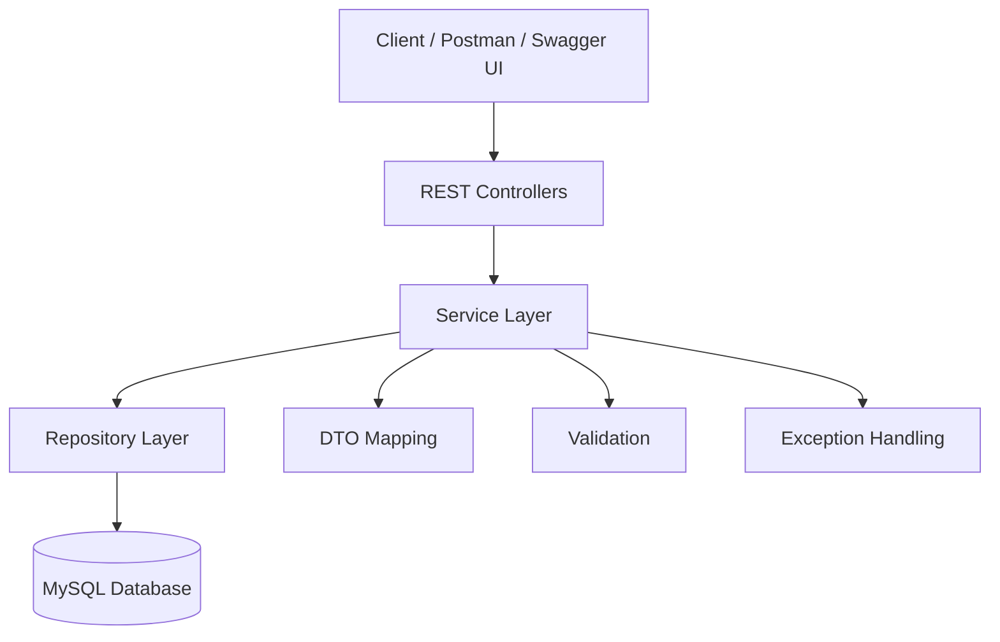
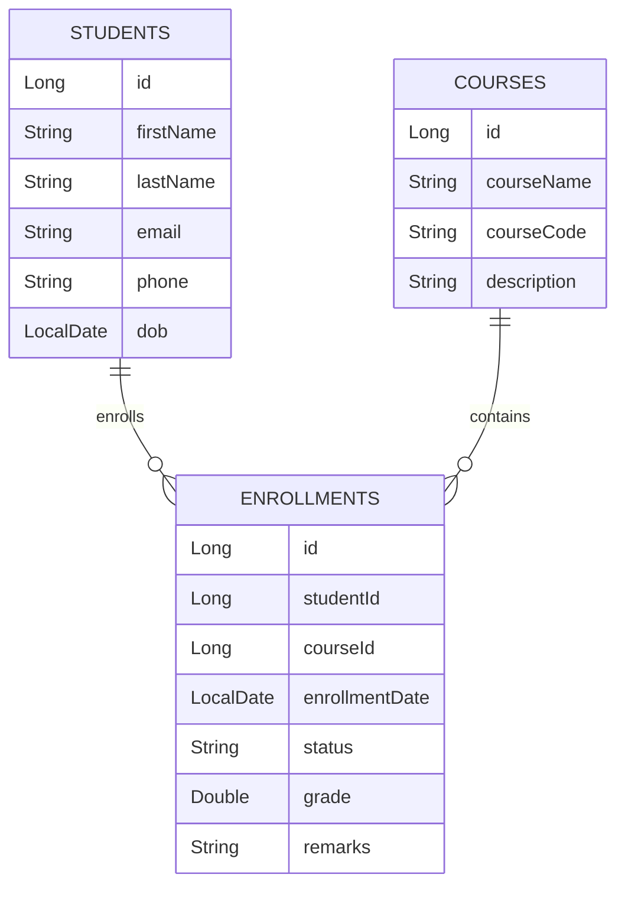
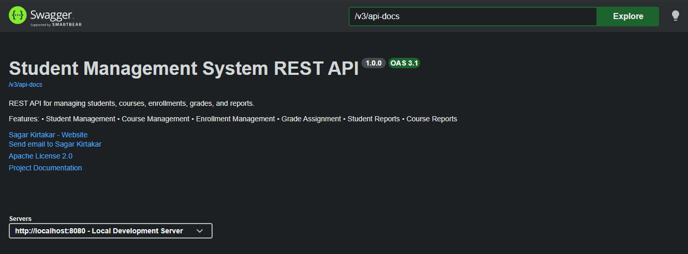
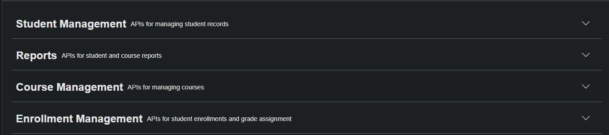
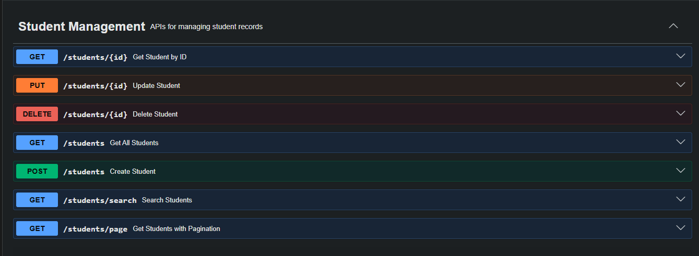
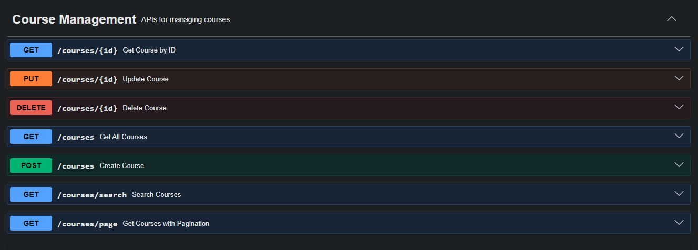
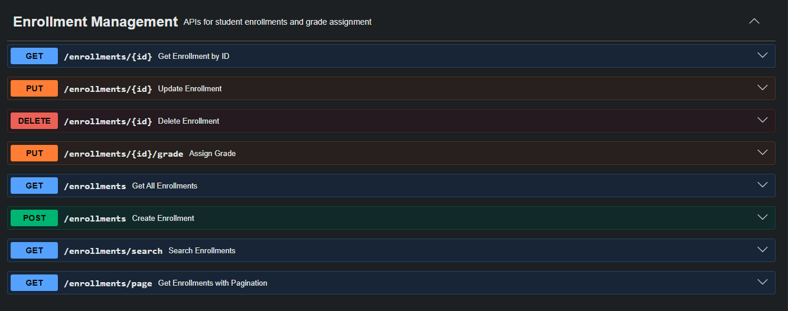
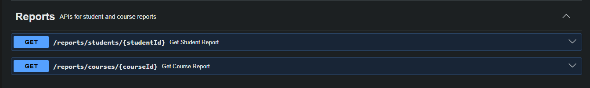

# 🎓 Student Management System REST API


## 📑 Table of Contents

- 📖 Project Description
- ✨ Features
- 🛠 Tech Stack
- 🏗 Architecture
- 📂 Project Structure
- 🗄 Database Schema
- 📊 ER Diagram
- 🚀 REST API Endpoints
- ⚙ Installation
- ▶ Running the Project
- 🧪 Testing
- 📖 Swagger Documentation
- 📸 Screenshots
- 🚀 Future Enhancements
- 👨‍💻 Author
- 📄 License

## 📖 Project Description

The **Student Management System REST API** is a backend application built using **Spring Boot** that provides RESTful APIs for managing students, courses, enrollments, grades, and reports.

The project follows a clean layered architecture and demonstrates enterprise backend development practices including validation, exception handling, pagination, searching, testing, and API documentation.

This project was built as part of a Java Backend Developer learning journey and showcases production-ready REST API development using Spring Boot.

## 🌟 Project Highlights

- ✅ Layered Architecture
- ✅ RESTful APIs
- ✅ CRUD Operations
- ✅ Pagination & Sorting
- ✅ Search APIs
- ✅ Bean Validation
- ✅ Global Exception Handling
- ✅ Swagger/OpenAPI Documentation
- ✅ JUnit & Mockito Testing
- ✅ Report Generation

## ✨ Features

### 👨‍🎓 Student Management
- Create Student
- Get Student by ID
- Get All Students
- Update Student
- Delete Student
- Search Students
- Pagination & Sorting

### 📚 Course Management
- Create Course
- Get Course by ID
- Get All Courses
- Update Course
- Delete Course
- Search Courses
- Pagination & Sorting

### 📝 Enrollment Management
- Enroll Student into Course
- Update Enrollment
- Delete Enrollment
- Search Enrollments
- Pagination & Sorting

### 🎯 Grade Management
- Assign Grades
- Update Grades
- Instructor Remarks
- ACTIVE Enrollment Validation

### 📊 Reports
- Student Performance Report
- Course Performance Report
- Average Grade Calculation

### 🛡 Validation & Exception Handling
- Bean Validation
- Custom Exceptions
- Global Exception Handler

### 📖 API Documentation
- Swagger UI
- OpenAPI 3 Documentation

### ✅ Testing
- JUnit 5
- Mockito
- MockMvc

## 🛠️ Tech Stack

| Category | Technologies |
|----------|--------------|
| Language | Java 21 |
| Framework | Spring Boot |
| ORM | Spring Data JPA, Hibernate |
| Database | MySQL |
| Build Tool | Maven |
| API Documentation | Swagger / OpenAPI 3 |
| Validation | Jakarta Bean Validation |
| Object Mapping | ModelMapper |
| Boilerplate Reduction | Lombok |
| Testing | JUnit 5, Mockito, MockMvc |
| Version Control | Git & GitHub |
| IDE | IntelliJ IDEA |

## 🏗️ Project Architecture



## 📂 Project Structure

```text
src
├── main
│   ├── java
│   │   └── com.sagar.sms
│   │       ├── config
│   │       ├── controller
│   │       ├── dto
│   │       ├── entity
│   │       ├── exception
│   │       ├── repository
│   │       ├── services
│   │       └── StudentManagementSystemApplication.java
│   │
│   └── resources
│       ├── application.properties
│       └── static
│
└── test
    └── java
        └── com.sagar.sms
            ├── controller
            └── services
```

## 🗄️ Database Schema

The application uses **MySQL** and consists of the following tables:

- **students**
- **courses**
- **enrollments**

### Relationships

- One Student → Many Enrollments
- One Course → Many Enrollments
- Enrollment stores:
  - Student
  - Course
  - Grade
  - Remarks
  - Status

 ## 📊 Entity Relationship Diagram



# 🚀 REST API Endpoints

## 👨‍🎓 Student Management

| Method | Endpoint | Description |
|:------:|----------|-------------|
| POST | `/students` | Create a new student |
| GET | `/students` | Get all students |
| GET | `/students/{id}` | Get student by ID |
| PUT | `/students/{id}` | Update student |
| DELETE | `/students/{id}` | Delete student |
| GET | `/students/search` | Search students by first name |
| GET | `/students/page` | Get students with pagination & sorting |

---

## 📚 Course Management

| Method | Endpoint | Description |
|:------:|----------|-------------|
| POST | `/courses` | Create a new course |
| GET | `/courses` | Get all courses |
| GET | `/courses/{id}` | Get course by ID |
| PUT | `/courses/{id}` | Update course |
| DELETE | `/courses/{id}` | Delete course |
| GET | `/courses/search` | Search courses by course name |
| GET | `/courses/page` | Get courses with pagination & sorting |

---

## 📝 Enrollment Management

| Method | Endpoint | Description |
|:------:|----------|-------------|
| POST | `/enrollments` | Enroll a student into a course |
| GET | `/enrollments` | Get all enrollments |
| GET | `/enrollments/{id}` | Get enrollment by ID |
| PUT | `/enrollments/{id}` | Update enrollment |
| DELETE | `/enrollments/{id}` | Delete enrollment |
| GET | `/enrollments/search` | Search enrollments by status |
| GET | `/enrollments/page` | Get enrollments with pagination & sorting |

---

## 🎯 Grade Management

| Method | Endpoint | Description |
|:------:|----------|-------------|
| PUT | `/enrollments/{id}/grade` | Assign or update a student's grade |

---

## 📊 Reports

| Method | Endpoint | Description |
|:------:|----------|-------------|
| GET | `/reports/students/{studentId}` | Generate student performance report |
| GET | `/reports/courses/{courseId}` | Generate course performance report |

---

## 📖 Swagger Documentation

After running the application, access the API documentation using:

| Resource | URL |
|----------|-----|
| Swagger UI | `http://localhost:8080/swagger-ui/index.html` |
| OpenAPI JSON | `http://localhost:8080/v3/api-docs` |

# ⚙️ Installation

## Prerequisites

Make sure you have the following installed:

- Java 21
- Maven 3.9+
- MySQL 8+
- Git
- IntelliJ IDEA (Recommended)

---

## Clone the Repository

```bash
git clone https://github.com/SagarKirtakar/student-management-system.git
```

```bash
cd student-management-system
```

---

## Configure Database

Create a MySQL database.

```sql
CREATE DATABASE student_management_system;
```

Update the database configuration in **application.properties**.

```properties
spring.datasource.url=jdbc:mysql://localhost:3306/student_management_system
spring.datasource.username=root
spring.datasource.password=your_password

spring.jpa.hibernate.ddl-auto=update
spring.jpa.show-sql=true
```

---

## Build the Project

```bash
mvn clean install
```

## ▶️ Running the Application

Start the Spring Boot application using Maven:

```bash
mvn spring-boot:run
```

Or run the main class:

```text
StudentManagementSystemApplication.java
```

Once the application starts, it will be available at:

```
http://localhost:8080
```

## 🧪 Running Tests

Run all unit and controller tests using Maven:

```bash
mvn test
```

### Testing Frameworks Used

- JUnit 5
- Mockito
- Spring Boot Test
- MockMvc

## 📖 Swagger API Documentation

After starting the application, access the interactive API documentation.

| Documentation | URL |
|---------------|-----|
| Swagger UI | http://localhost:8080/swagger-ui/index.html |
| OpenAPI JSON | http://localhost:8080/v3/api-docs |

Swagger provides:

- Interactive API testing
- Request & Response examples
- Validation details
- Response codes
- Schema documentation

# 📸 Screenshots

## Swagger UI




---

## Student APIs



---

## Course APIs



---

## Enrollment APIs



---

## Reports APIs



# 🚀 Future Enhancements

The following features can be added in future releases:

- 🔐 Spring Security with JWT Authentication
- 👥 Role-Based Access Control (Admin, Faculty, Student)
- 🐳 Docker & Docker Compose Support
- ☁️ AWS EC2 Deployment
- ⚙️ GitHub Actions CI/CD Pipeline
- 📧 Email Notifications
- 📄 PDF Report Generation
- 📊 Dashboard & Analytics
- 📁 File Upload for Student Profile
- 📅 Attendance Management
- 📝 Examination Management
- 💰 Fee Management
- 📱 Frontend Integration (React)
- 📈 Monitoring with Spring Boot Actuator
- 📝 Logging using SLF4J & Logback

# 👨‍💻 Author

**Sagar Kirtakar**

Java Full Stack Developer

- 📧 Email: sagarkirtakar2002@gmail.com
- 💼 LinkedIn: https://www.linkedin.com/in/sagar-kirtakar-47255a202/
- 💻 GitHub: https://github.com/SagarKirtakar

If you found this project helpful, consider giving it a ⭐ on GitHub.

# 📄 License

This project is licensed under the **Apache License 2.0**.

You are free to use, modify, and distribute this project in accordance with the terms of the license.

For more details, see the **LICENSE** file.


